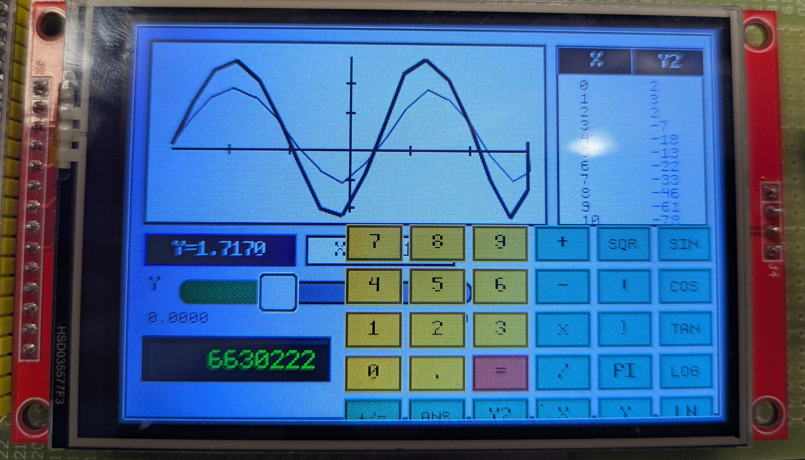
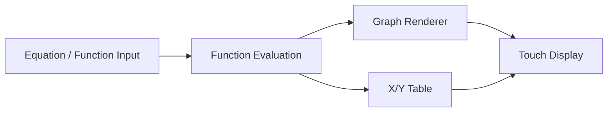

# GraphPad

**A low-cost, touchscreen graphing calculator for accessible mathematics education.**

GraphPad explores a central question: how can advanced mathematics tools, including graphing, functions, plotting, tables, and eventually symbolic mathematics, reach students who may not have access to traditional graphing calculators?

Devices such as the TI-84 and comparable Casio calculators are common in mathematics education, but their cost can be significant for students and under-resourced schools. GraphPad explores a lower-cost alternative built around an ESP32-based embedded platform and a touchscreen interface.

> GraphPad is an early, work-in-progress prototype. It explores accessible embedded mathematics tools and is not yet intended to replace mature commercial calculators.

  

<em>Current GraphPad prototype showing simultaneous function plots, an x/y value table, equation input, numerical controls, and a parameter slider for observing graph changes interactively.</em>

## Current Features

| Feature | Description |
| --- | --- |
| Function plotting | Enter mathematical functions and visualize them directly on the display |
| Multiple functions | Plot and compare multiple equations simultaneously |
| X/Y table | View calculated x/y values alongside the plotted function |
| Interactive parameter slider | Adjust a parameter and observe the graph update interactively |
| Graph preview | View axes and plotted functions in a large graph area |
| Touch interface | Use calculator controls through the touchscreen |
| On-screen keypad | Enter numeric, arithmetic, trigonometric, logarithmic, and other mathematical inputs |
| Embedded architecture | Runs directly on an ESP32-based microcontroller without requiring a PC |

## How the Current UI Works

1. The student enters or selects a mathematical function.
2. GraphPad evaluates points across the selected range.
3. The function is plotted in the main display area.
4. Corresponding x/y values appear in the adjacent table.
5. The student uses a slider to change a parameter or value.
6. The graph preview updates so the student can explore how that change affects the function.

The interface is intended to support experimentation with functions, not only calculation of answers.

## System Pipeline

## Hardware

| Component | Specification |
| --- | --- |
| MCU | ESP32-based embedded platform |
| Display | Color TFT; the exact controller and resolution are not yet documented in this repository |
| Input | Touchscreen; the touch technology and controller are not yet documented in this repository |
| Interface | Touch-first graphical calculator UI |
| Firmware | Firmware and build configuration are not yet published in this repository |
| Power | Portable embedded-device configuration; implementation details are not yet documented |

## Project Status

| Area | Status |
| --- | --- |
| Embedded hardware prototype | ✅ Working prototype |
| Function plotting | ✅ Prototype |
| Multiple functions | ✅ Prototype |
| X/Y value table | ✅ Prototype |
| Interactive parameter slider | ✅ Prototype |
| Touch calculator UI | ✅ Prototype |
| Advanced graph navigation | 🚧 In development |
| Symbolic mathematics | 🧭 Planned |
| Broader calculator apps and tools | 🧭 Planned |

## Roadmap

Later iterations aim to provide more of the tools students expect from common graphing calculators while retaining a low-cost embedded architecture. Potential work includes:

- Improved graph zooming, panning, and table exploration
- Multiple graph modes and function management
- Roots, intersections, minima, and maxima
- Statistics, matrices, and probability tools
- Symbolic mathematics and CAS-style functionality
- Saved variables and functions
- Expanded scientific calculator tools
- Educational visualizations and interactions
- An app browser for multiple focused mathematics tools

These items are directions for future development, not current features.

## Why GraphPad?

GraphPad combines an engineering project with an educational-access experiment. Graphing calculators can be important tools for understanding functions visually, but dedicated devices are not equally accessible to every classroom. GraphPad investigates how much of that experience can be reproduced on inexpensive embedded hardware while using touch interaction to encourage exploration.

## Building

Firmware and build configuration have not yet been published in this repository, so reproducible build and upload instructions are not currently available.
